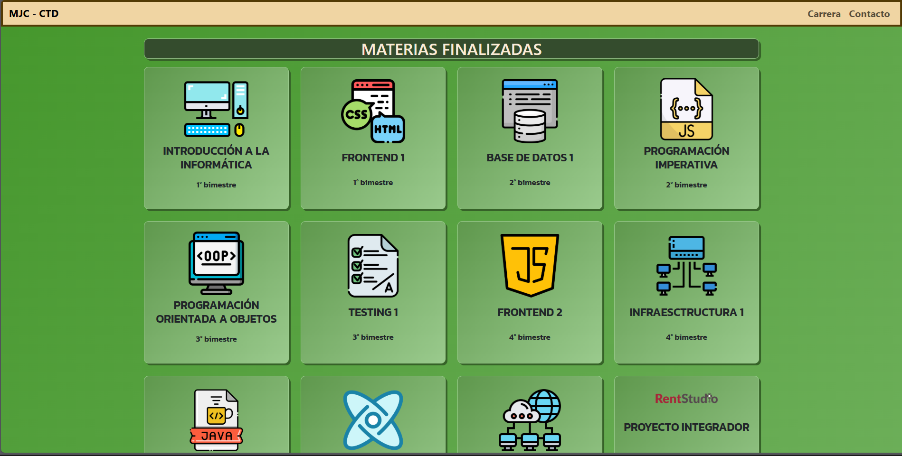
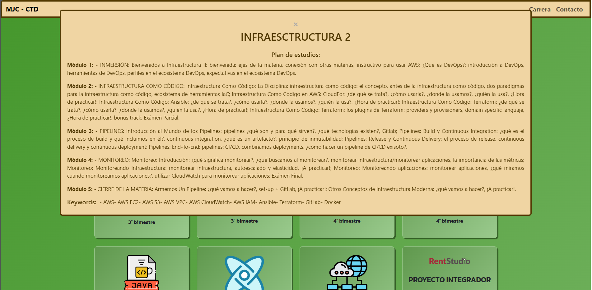

# 🎓 Project - Certified Tech Developer  

## 📌 Career description  

**Certified Tech Developer** is an intensive training programme created by **Digital House** in collaboration with **Mercado Libre** and **Globant**, designed to train software developers with a focus on the skills most in demand by the industry.  

The curriculum covers diverse areas of development, including **web programming, databases, infrastructure, testing, agile methodologies and application development**. With a duration of **21 months**, the programme combines theory and practice, allowing students to gain experience in real projects and prepare for the world of work in technology. 

---

## 💻 About the project  

This project is a web application that allows you to view the list of **subjects** and **workshops** of the Certified Tech Developer programme, together with their respective syllabus. It also includes:

- 📜 **My CV** with information about my education and experience.  
- ℹ️ **A section about me**, highlighting my interests and background.

### 🚀 Technologies used

| Technology     | Description |
|---------------|------------|
|  | Structure of the application. |
|  | Styles and design. |
|  | Interactivity and dynamic functionalities. |
|  | Responsive design and predefined components. |

---

## 🎯 Main functionalities  

✅ Display of subjects and workshops with their descriptions.
✅ Access to the syllabus of each subject.  
✅ Section for personal presentation and curriculum vitae. 

---

Link al sitio: https://careerproyectctd.netlify.app/
